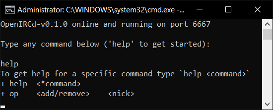

# OpenIRCd
OpenIRCd is an easy-to-use non-blocking high performance IRC server written in Java.



**This is a work in progress** and acts as an example of how to use the [Socket-Server](https://github.com/Konloch/Socket-Server/) library.

## How To Use
+ Start by [downloading the latest release](https://github.com/Konloch/OpenIRCd/releases), then you can launch the IRCd using the Java -jar flag.
```
java -jar OpenIRCd-v0.1.0.jar
```
+ This will create the default config under `./config.ini`
+ Adjust the configuration as needed, then restart the server.

### Commands
+ You can execute commands through the CLI by executing it directly as a program argument
    + This will save the database to disk once the command has finished executing.
+ Or, you can execute commands from the terminal just by executing it normally and typing into the console.
+ Type `help` to get started.
+ To give operator priviliges just type `op add <nick>` - *Oppers have to setup and verify with nickserv*.

### Translations
+ Translations are automatic, to define a specific translation go into the `config.ini` and edit `translation=<translation goes here>`
+ Fully translated into `English, Arabic, Croatian, Czech, Bulgarian, Danish, Estonian, Farsi, Finnish, French, German, Georgian, Greek, Hausa, Hebrew, Hungarian, Indonesian, Italian, Japanese, Lativan, Lithuanian, Malay, Mandarin, Nederlands, Norwegian, Polish, Portuguese, Romanian, Russian, Slovak, Slovenian, Spanish, Serbian, Swahili, Swedish, Turkish, Ukrainian & Vietnamese`.

## Implementation Progress
+ `IRC v1` is the target but certain `IRC v3 extensions` are planned to be supported ([SASL](https://ircv3.net/specs/extensions/sasl-3.1))
+ Configuration is done and supports variables
+ Command base with CLI is done
+ Core protocol decoding and encoding is done
+ Core API has been started and is partially finished
+ Temporary channels are done but persistent channels with permissions have not been started
+ NickServ / authorization has been started
+ User modes aren't started
+ Channel modes aren't started
+ Plugins / event system has been started

## Links
* [Website](https://konloch.com/OpenIRCd/)
* [Discord Server](https://discord.gg/aexsYpfMEf)
* [Download Releases](https://github.com/Konloch/OpenIRCd/releases)
